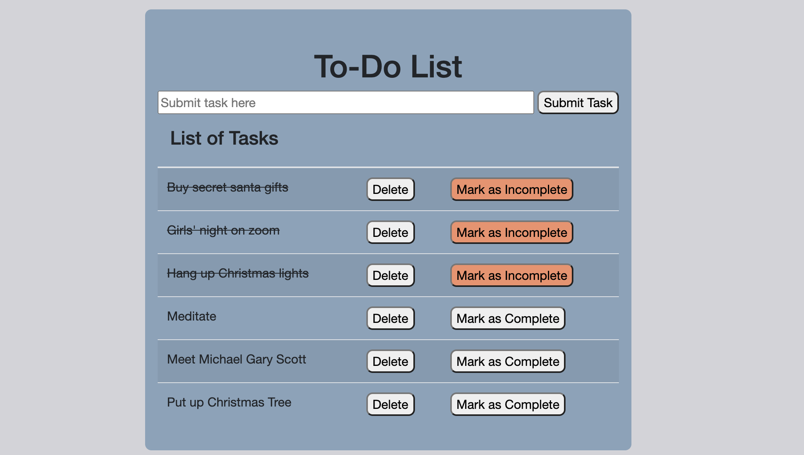

# PROJECT NAME

## Description

_Duration: 15 HOURS

Application that allows user to input task onto input forms. Buttons are available for user to delete task, mark task as completed (line-through completed tasks will become visible upon clicking 'Mark as Complete' button), or revert task back to incomplete.

To see the fully functional site, please visit: [DEPLOYED VERSION OF APP](www.heroku.com)

## Screen Shot

### Prerequisites

- [Node.js](https://nodejs.org/en/)

## Installation

1. Create a database named `weekend-to-do-app`,
2. The queries in the `tables.sql` file are set up to create all the necessary tables and populate the needed data to allow the application to run correctly. The project is built on [Postgres](https://www.postgresql.org/download/), so you will need to make sure to have that installed. We recommend using Postico to run those queries as that was used to create the queries, 
3. Open up your editor of choice and run an `npm install`
4. Run `npm run server` in your terminal
5. Run `npm run client` in your terminal
6. The `npm run client` command will open up a new browser tab for you!

## Usage

1. Submit task into input form
2. Click submit
3. Once task is completed, click on button 'Mark as Complete'
4. If task is not thoroughly completed, revert status of task back to 'Mark as Complete' by clicking on
button that reads 'Mark as Incomplete'.
5. Utilize delete button once task is completed

## Built With

* HTML
* CSS
* JavaScript
* Jquery
* PostgresSQL

## License

## Acknowledgement
Thanks to [Prime Digital Academy](www.primeacademy.io) who equipped and helped me to make this application a reality. 

## Support
If you have suggestions or issues, please email me at [maivyerthao@gmail.com]

